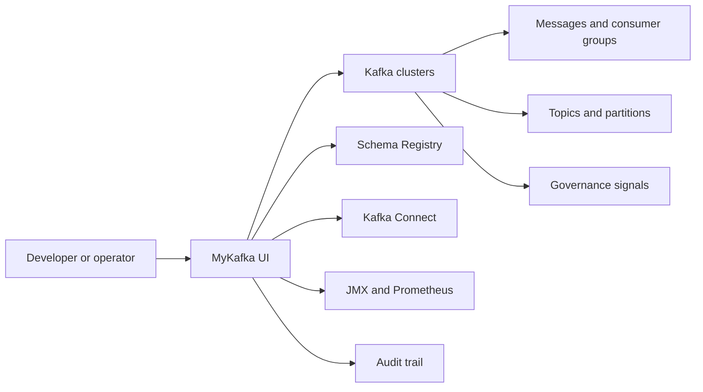
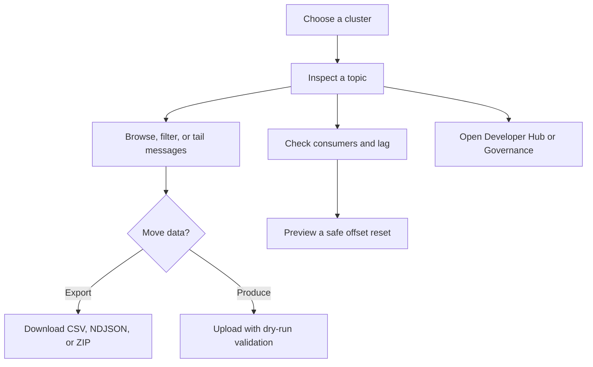
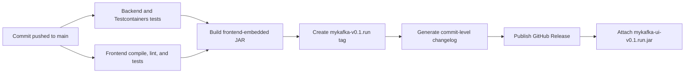
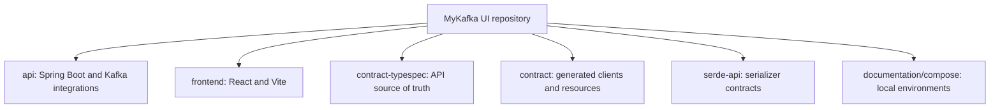

<div align="center">

# MyKafka UI

**Kafka operations with a clear view.**

A personal, independently maintained Kafka control surface for developers and operators who need to inspect, move, govern, and troubleshoot Kafka data without losing the thread.

[](https://github.com/joelpjoji-mns/Mykafka-Ui/actions/workflows/branch-ci.yml)
[](https://github.com/joelpjoji-mns/Mykafka-Ui/releases)
[](LICENSE)

[Release Downloads](https://github.com/joelpjoji-mns/Mykafka-Ui/releases) · [Changelog](CHANGELOG.md) · [Workflow Runs](https://github.com/joelpjoji-mns/Mykafka-Ui/actions) · [Repository](https://github.com/joelpjoji-mns/Mykafka-Ui)

</div>

---

## What MyKafka UI Is

MyKafka UI keeps the mature Kafka administration foundation from upstream Kafbat UI and adds operational workflows that are useful during real development and incident response: safe consumer resets, history-plus-live message tailing, topic data transfer, audit exploration, governance advice, cluster operations, and developer signals.

The MyKafka UI mark is an original bat-inspired fork mark. It is not the official Batman or DC logo.



## Built For The Work In Front Of You

| Surface | What it gives you |
| --- | --- |
| **Messages** | Serde-aware browsing, multiple text refinements, smart filters, timestamp windows, offset seeks, resizable columns, key/header/value previews, and live arrivals at the top of the table. |
| **Live tail** | A bounded historical snapshot first, then a gap-free stream from checkpointed Kafka end offsets. New records arrive above the existing view. |
| **Consumer safety** | Offset reset impact previews for earliest, latest, timestamp, and explicit offsets. Active groups can wait for a safe inactive state before the mutation occurs. |
| **Topic transfer** | Download CSV, NDJSON, or ZIP exports with partition/filter/serde controls. Upload one file, many files, or ZIP archives with dry-run previews and routing strategies. |
| **Developer Hub** | Topic health, topology, storage, configuration, traffic, consumer, and integration signals with concrete next actions. |
| **Operations Center** | Cluster-wide health, broker state, topic pressure, consumer lag, and integration status in one place. |
| **Governance and audit** | Topic compliance recommendations, an audit explorer with cursor pagination, and cross-topic record search over bounded recent samples. |
| **Visual modes** | Auto, Light, Dark, Midnight, Harbor, Ember, AMOLED, and Glass. Glass uses material navigation and transient controls while keeping data tables stable and readable. |



## Release-Ready By Default

Every successful push to `main` follows the same release lane. Pull requests receive checks and a packaged JAR, but only green `main` commits create a public release.



### Release Contract

- A green `main` run creates `mykafka-v0.1.<workflow-run>`.
- The application version and GitHub release tag are identical, so the UI can accurately identify the latest release.
- The release asset is named `mykafka-ui-v0.1.<workflow-run>.jar`.
- Release notes include the exact non-merge commits since the previous `mykafka-v*` tag, falling back to the last compatible `custom-v*` release for the first MyKafka UI release.
- Workflow artifacts are retained for 30 days in addition to the GitHub Release asset.
- The manual **MyKafka UI: Build Release JAR** workflow remains available for an artifact-only build or an explicitly named release.

## Download And Run

1. Open [Releases](https://github.com/joelpjoji-mns/Mykafka-Ui/releases).
2. Download the latest `mykafka-ui-v*.jar` asset.
3. Run it with your configuration file.

```bash
java -jar mykafka-ui-v0.1.<run>.jar \
  --spring.config.additional-location=path/to/mykafka-ui-config.yaml
```

The packaged application exposes health at `/actuator/health` and build information at `/actuator/info`.

## Local Development

### Prerequisites

| Tool | Version |
| --- | --- |
| Java | 25 |
| Node.js | 22.13.0 |
| pnpm | 10.26.1 |
| Docker | Required for integration and compose environments |

### Build A Local JAR

```bash
./gradlew :api:bootJar --no-daemon \
  -Pinclude-frontend=true \
  -Pversion=mykafka-local

java -jar api/build/libs/api-mykafka-local.jar \
  --spring.config.additional-location=path/to/mykafka-ui-config.yaml
```

### Validate The Stack

```bash
# Backend, including Kafka/Testcontainers coverage
./gradlew :api:test

# Frontend contract generation, typecheck, lint, and tests
cd frontend
pnpm install --frozen-lockfile
pnpm compile
pnpm eslint --quiet --ext .tsx,.ts src/
pnpm test:CI
```

Use the managed Node 22 development server so the local checker matches CI:

```bash
./gradlew :frontend:devFrontend
```

Set `VITE_DEV_PROXY` in `frontend/.env.local` when the frontend should proxy requests to a separately running API.

## Configuration At A Glance

| Need | Setting |
| --- | --- |
| Dynamic cluster configuration | `DYNAMIC_CONFIG_ENABLED=true` |
| Swagger UI | Set `SWAGGER_UI_ENABLED=true`, then open `/swagger-ui/index.html` |
| Dynamic config path | `/etc/kafkaui/dynamic_config.yaml` |
| Health endpoints | `/actuator/health` and `/actuator/info` |
| Compose examples | [documentation/compose](documentation/compose) |

MyKafka UI supports the existing Kafka, Schema Registry, Connect, KSQL, JMX, Prometheus, authentication, RBAC, and masking configuration model from upstream.

## Changelog Philosophy

The repository keeps a human-readable policy in [CHANGELOG.md](CHANGELOG.md), while each release contains the authoritative commit-level changelog generated from Git history. That gives every JAR a concrete answer to: *what changed since the last release?*

## Project Map



## Attribution

MyKafka UI is derived from [Kafbat UI](https://github.com/kafbat/kafka-ui) and remains distributed under the [Apache License 2.0](LICENSE). This fork is independently maintained and is not affiliated with, endorsed by, or released by the upstream Kafbat organization.
